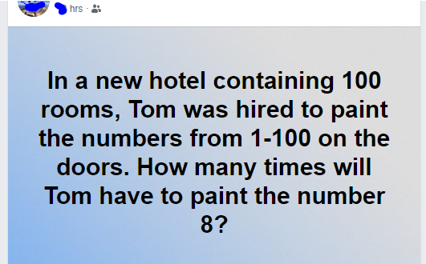

A FB friend posted this question:

* In a new hotel containing 100 rooms, Tom was hired to paint the numbers from 1-100 on the doors. How many times will Tom have to paint the number 8?

I thought it would be fun to code it up...

Here is the original FB post....the comments were also interesting

  

The output is simple. It just says:  The number of 8s painted is:  ##  

I should not give the number since FB people are still having fun with it.

I included one test to check for negative room count.  I get that it would need more to be robust testing.